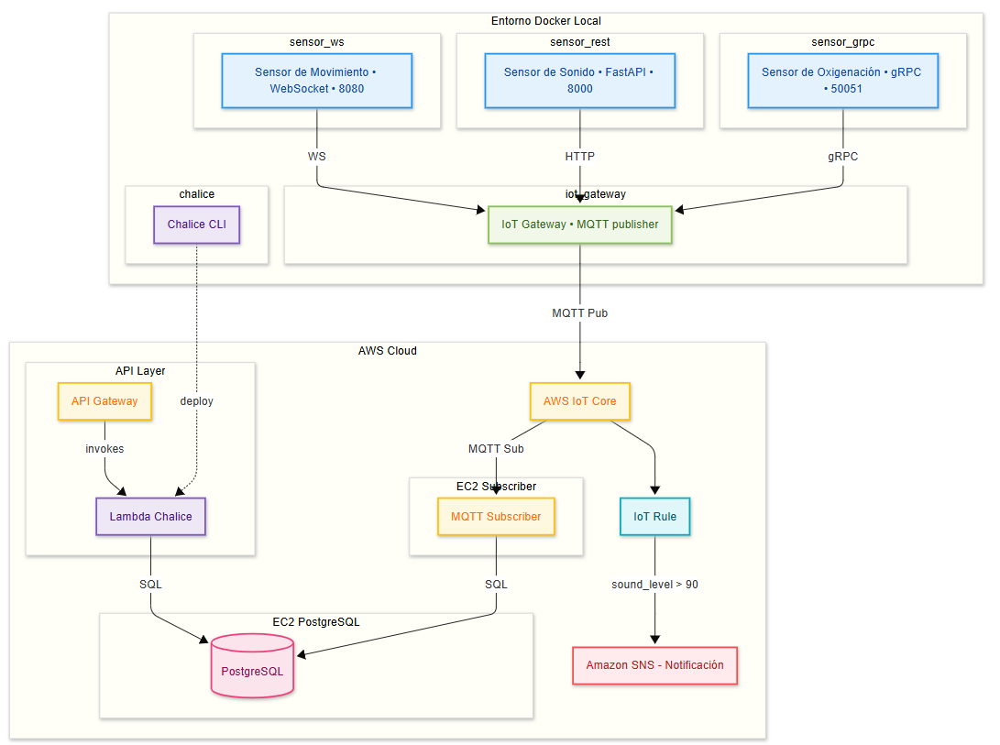
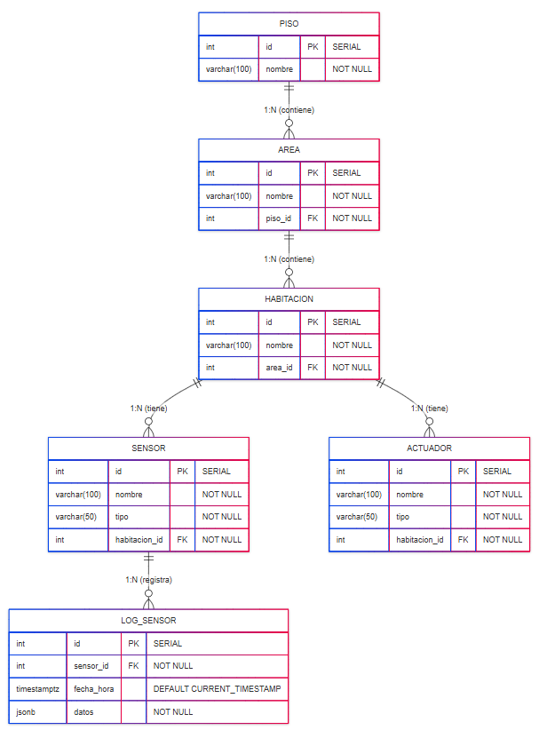

# Sistema de Monitoreo y Alerta para Pacientes con IoT y AWS

## Contexto 

En entornos hospitalarios y de atención domiciliaria, es esencial contar con sistemas de monitoreo y alerta que garanticen la seguridad, el bienestar y una respuesta inmediata para pacientes en situación de vulnerabilidad, como aquellos con movilidad reducida, dificultades de comunicación o condiciones mentales como demencia o delirio. 

Este proyecto implementa un Sistema de Alerta para Pacientes basado en IoT, compuesto por sensores y software interconectado. El sistema permite recoger datos en tiempo real sobre el entorno y el estado del paciente, detectar situaciones anómalas y generar notificaciones automáticas al personal médico o familiar. 

Además, ofrece herramientas para la comunicación remota y la supervisión continua, adaptable tanto a hospitales como a residencias o domicilios particulares.

---
## Estructura proyecto

```
Final_lot_Project/
│
├── docker-compose.yml              # Configuración general de containers dl Iot gateway y los sensores 
│
├── APIRest/                        # API rest con Chalice 
│   ├── app.py                      # Aplicación principal de Chalice
│   ├── requirements.txt            # Dependencias de la API
│   └──.chalice/                    # Configuración de Chalice
│
├── IoT_Gateway/   
│   ├── Dockerfile                  # Configuración para containerizar el gateway  
│   ├── requirements.txt            # Dependencias de Python (gRPC, MQTT, WebSockets, etc.)  
│   ├── grpc_handler.py             # Maneja comunicación gRPC con dispositivos/servicios  
│   ├── sensor.proto                # Definición de protobuf para los mensajes de sensores  
│   ├── websocket_handler.py        # Gestiona conexiones en tiempo real vía WebSockets  
│   ├── start.sh                    # Script para iniciar el servicio (configura variables, lanza app)  
│   ├── MQTT_proyecto-Policy        # Política de seguridad AWS IoT para MQTT  
│   └── ... (otros certs)           # Certificados TLS/SSL para autenticación con AWS IoT Core  
│
├── database/
│   ├── init.sql                    # Scripts de inicialización
│   └── postgresSQL.pem             # Key de la EC2
│
├── sensors/                        # Carpeta principal de dispositivos sensores
│   ├── grpc_sensor/                # Sensor de Oxigenación en Sangre (protocolo gRPC)
│   │   ├── Dockerfile              # Configuración de container para el sensor
│   │   ├── client.py               # Lógica del cliente sensor (envío de datos vía gRPC)
│   │   ├── sensor.proto            # Esquema de comunicación gRPC (métodos y estructura de datos)
│   │   └── requirements.txt        # Dependencias
│   │
│   ├── rest_sensor/                # Sensor de Sonido Ambiental (protocolo REST)
│   │   ├── Dockerfile              # Containerización para sensor REST
│   │   ├── client.py               # Implementación de cliente HTTP/REST
│   │   └── requirements.txt        # Dependencias 
│   │
│   └── ws_sensor/                  # Sensor de Movimiento (protocolo WebSocket)
│       ├── Dockerfile              # Configuración para entorno WebSocket
│       ├── client.py               # Cliente para comunicación en tiempo real
│       └── requirements.txt        # Dependencias 
│
└──subscribers/                   # Suscriptores MQTT
    ├── sub_Key.pem               # Key de la instancia EC2
    └── certs/                     
       ├── MQTT_proyecto-Policy   # Certificados AWS
       ├── ... (otros certs)
       ├── subscriber.py          # Lógica principal
       └── start.sh               # Script de inicio

 

```

---

## Arquitectura del proyecto 


---

##  Sensores Simulados y Arquitectura

Este proyecto simula un entorno hospitalario de IoT con sensores distribuidos, cada uno ejecutado en su propio contenedor Docker y comunicándose con un **Gateway** central, también en contenedor. El Gateway se encarga de recibir los datos por distintos protocolos (gRPC, REST, WebSocket) y reenviarlos a **AWS IoT Core** para su procesamiento en la nube.

### Sensor de Oxigenación en Sangre (`SensorGRPC`)
- Contenedor: `sensor_grpc`  
- Protocolo: **gRPC**  
- Simula datos de un oxímetro de pulso que se envían cada 30 segundos.

**Datos simulados:**
- `heart_rate_bpm`: Frecuencia cardíaca en BPM (ej. 75)
- `spo2_percent`: Saturación de oxígeno en sangre (%)
- `raw_ir`: Señal infrarroja captada
- `raw_red`: Señal roja captada
- `timestamp`: Fecha y hora del evento
---

### Sensor de Sonido Ambiental (`SensorRest`)
- Contenedor: `sensor_rest`  
- Protocolo: **REST (HTTP)**  
- Simula el ruido ambiental cerca del paciente, enviando datos cada 30 segundos al endpoint del gateway (`/sound`).

**Datos simulados:**
- `sound_level_db`: Nivel actual de sonido (dB)
- `max_sound_level`: Nivel máximo en el intervalo
- `min_sound_level`: Nivel mínimo en el intervalo
- `duration_active_sec`: Duración del ruido
- `timestamp`: Fecha y hora del evento
---

### Sensor de Movimiento (`SensorWS`)
- Contenedor: `sensor_ws`  
- Protocolo: **WebSocket**  
- Emula movimiento del paciente o cambios en el entorno, reportando cada 30 segundos mediante WebSocket.

**Datos simulados:**
- `presence`: Si hay movimiento o no
- `duration_active_sec`: Tiempo que duró el movimiento
- `intensity`: Intensidad del movimiento (0.1 a 1.0)
- `direction`: Dirección del movimiento (NORTE, SUR, ESTE, OESTE, etc.)
- `timestamp`: Fecha y hora del evento
---

## Gateway IoT 

El Gateway opera como un puente inteligente entre los sensores simulados y la nube de AWS. Su diseño modular le permite manejar diferentes protocolos simultáneamente, estandarizar los datos, aplicar validaciones básicas y reenviarlos a AWS IoT Core.

- **Contenedor**: `iot_gateway`  
- **Función**: Recibe, integra y redirige los datos provenientes de los sensores mediante múltiples protocolos (gRPC, REST y WebSocket) hacia **AWS IoT Core**.  
- **Tecnología**: Python (FastAPI), MQTT, AWS SDK, Docker
---

##  AWS IoT Core 

Este sistema utiliza **AWS IoT Core** como plataforma central para la gestión y comunicación de sensores en un entorno hospitalario. Se diseñó para monitorear en tiempo real datos críticos como movimiento, oxigenación y sonido en habitaciones específicas del hospital.

### Políticas de AWS IoT Core

Este proyecto utiliza una política personalizada para habilitar la comunicación entre los dispositivos IoT del hospital y AWS IoT Core. A continuación se describen los permisos otorgados:


###  Acciones permitidas:

#### 1. Publicar y recibir mensajes

Los dispositivos pueden publicar, recibir y retener mensajes en los siguientes topics:

- `Hospital1/Sede1/Edificio1/Piso1/Area1/Habitacion1/sensorMovimiento/sensor0`
- `Hospital1/Sede1/Edificio1/Piso1/Area1/Habitacion1/sensorOxigenacion/sensor0`
- `Hospital1/Sede1/Edificio1/Piso1/Area1/Habitacion1/sensorSonido/sensor0`
- `Hospital1/Sede1/Edificio1/Piso1/Area1/Habitacion1/sensorSonido/sensor0/alertaSonidoAlto`
- `Hospital1/Sede1/Edificio1/Piso2/Area1/Habitacion1/sensorMovimiento/sensor0`
- `Hospital1/#` 

#### 2. Suscripción a topics

Permite a los dispositivos suscribirse a los siguientes topics:

- Topics específicos:
  - Movimiento, oxigenación y sonido de `sensor0` en una habitación específica.
- Topics con comodines:
  - `Hospital1/#`
  - `Hospital1/Sede1/Edificio1/Piso1/#`
  - `Hospital1/Sede1/Edificio1/Piso2/#`

#### 3. Conexión de clientes

Los siguientes clientes están autorizados a conectarse a AWS IoT Core:

- `basicSub`
- `basicPub`
- `basicPubSub`
- `basicAlert`

---
## Subscriber 

- **Ubicación**: Máquina virtual EC2 en AWS  
- **Función**: Se suscribe a un conjunto de *topics* MQTT en **AWS IoT Core**, recibe los mensajes publicados por el Gateway y los almacena en una base de datos PostgreSQL.  


Este componente actúa como **cliente MQTT seguro**, que recibe datos desde AWS IoT Core y los inserta en una base de datos relacional.

---
## Base de Datos PostgreSQL

La base de datos está en una instancia EC2 aparte y modela la estructura física y lógica de un edificio con sensores y actuadores.

### Diagrama Entidad-Relación (MER)



### Estructura de Tablas

#### Tabla `piso`
| Columna | Tipo          | Restricción         | Descripción              |
|---------|---------------|---------------------|--------------------------|
| id      | SERIAL        | PRIMARY KEY         | Identificador único      |
| nombre  | VARCHAR(100)  | NOT NULL            | Nombre del piso          |


#### Tabla `area`
| Columna | Tipo          | Restricción         | Descripción                        |
|---------|---------------|---------------------|----------------------------------|
| id      | SERIAL        | PRIMARY KEY         | Identificador único              |
| nombre  | VARCHAR(100)  | NOT NULL            | Nombre del área                  |
| piso_id | INT           | NOT NULL, FOREIGN KEY → piso(id) ON DELETE CASCADE | Piso al que pertenece el área |


#### Tabla `habitacion`
| Columna  | Tipo          | Restricción         | Descripción                          |
|----------|---------------|---------------------|------------------------------------|
| id       | SERIAL        | PRIMARY KEY         | Identificador único                |
| nombre   | VARCHAR(100)  | NOT NULL            | Nombre de la habitación            |
| area_id  | INT           | NOT NULL, FOREIGN KEY → area(id) ON DELETE CASCADE | Área a la que pertenece la habitación |


#### Tabla `sensor`
| Columna        | Tipo          | Restricción         | Descripción                        |
|----------------|---------------|---------------------|----------------------------------|
| id             | SERIAL        | PRIMARY KEY         | Identificador único              |
| nombre         | VARCHAR(100)  | NOT NULL            | Nombre del sensor                |
| tipo           | VARCHAR(50)   | NOT NULL            | Tipo de sensor (ej. movimiento) |
| habitacion_id  | INT           | NOT NULL, FOREIGN KEY → habitacion(id) ON DELETE CASCADE | Habitación donde está instalado |


#### Tabla `actuador`
| Columna        | Tipo          | Restricción         | Descripción                          |
|----------------|---------------|---------------------|------------------------------------|
| id             | SERIAL        | PRIMARY KEY         | Identificador único                |
| nombre         | VARCHAR(100)  | NOT NULL            | Nombre del actuador                |
| tipo           | VARCHAR(50)   | NOT NULL            | Tipo de actuador (ej. ventilador) |
| habitacion_id  | INT           | NOT NULL, FOREIGN KEY → habitacion(id) ON DELETE CASCADE | Habitación donde está instalado   |


#### Tabla `log_sensor`
| Columna      | Tipo           | Restricción         | Descripción                                  |
|--------------|----------------|---------------------|----------------------------------------------|
| id           | SERIAL         | PRIMARY KEY         | Identificador único                          |
| sensor_id    | INT            | NOT NULL, FOREIGN KEY → sensor(id) ON DELETE CASCADE | Sensor que generó el dato                    |
| fecha_hora   | TIMESTAMPTZ    | DEFAULT CURRENT_TIMESTAMP | Fecha y hora del registro                    |
| datos        | JSONB          | NOT NULL            | Datos del sensor en formato JSON              |


---

## Notificaciones con AWS IoT + SNS

Utilizamos **AWS IoT Rules** para monitorear datos entrantes de sensores. Cuando un sensor de sonido excede un umbral definido (`sound_level > 90`), se activa una **regla** que envía una notificación automática usando **Amazon SNS**.

- **Topic escuchado**:  
  `Hospital1/Sede1/Edificio1/Piso1/Area1/Habitacion1/sensorSonido/sensor0`
  
- **Condición (SQL)**:  
  ```sql
  SELECT sound_level, device_id, timestamp  
  FROM 'Hospital1/Sede1/Edificio1/Piso1/Area1/Habitacion1/sensorSonido/sensor0'  
  WHERE sound_level > 90


---
## API REST

La API REST se desarrolla utilizando el framework Chalice dentro de un contenedor Docker, lo que proporciona un entorno aislado y reproducible para las fases de codificación y pruebas. Durante el desarrollo, el contenedor establece conexión directa con la base de datos PostgreSQL alojada en AWS EC2, permitiendo validar el comportamiento en un entorno similar al de producción.

### Proceso de Despliegue

Cuando se ejecuta el comando `chalice deploy` desde el contenedor Docker, se inicia un flujo automatizado que:
1. Empaqueta el código Python
2. Lo carga en AWS Lambda 
3. Configura un endpoint público mediante API Gateway

Este proceso genera una URL accesible externamente que sirve como punto de entrada para todas las solicitudes HTTP. La integración con AWS Lambda permite escalado automático y alta disponibilidad sin necesidad de gestionar infraestructura manualmente.


### Endpoints

| Método HTTP | Ruta                    | Propósito                                                                 | Operación en BD                     |
|-------------|-------------------------|---------------------------------------------------------------------------|-------------------------------------|
| `GET`       | `/`                     | Verificación de estado del servicio (Health Check)                        | Ninguna                            |
| `GET`       | `/sensors`              | Consulta el listado completo de sensores registrados                      | SELECT en tabla `sensor`           |
| `POST`      | `/sensors`              | Registra un nuevo sensor en el sistema                                    | INSERT en tabla `sensor`           |
| `GET`       | `/sensors/{sensor_id}`  | Recupera el histórico de eventos de un sensor específico                  | SELECT en tabla `log_sensor`       |
| `GET`       | `/actuators`            | Obtiene el inventario completo de actuadores disponibles                  | SELECT en tabla `actuador`         |
| `POST`      | `/actuators`            | Da de alta un nuevo actuador en la base de datos                          | INSERT en tabla `actuador`         |

